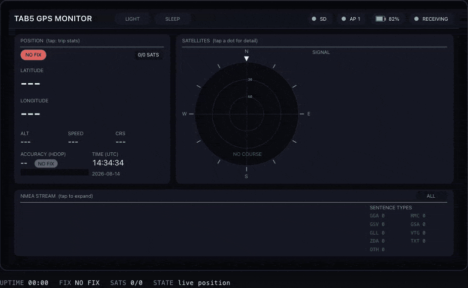

# tab5-gps-monitor

[](https://github.com/arunkumar-mourougappane/tab5-gps-monitor/actions/workflows/build.yml)
[](https://github.com/arunkumar-mourougappane/tab5-gps-monitor/releases)
[](LICENSE)
[](https://docs.m5stack.com/en/core/Tab5)
[](https://github.com/pioarduino/platform-espressif32)

A esp32-p4 (Tab5) application to integrate m5stack GPS/BDS Unit with SMA Antenna to demonstrate GPS Monitor

## Hardware

- [M5Stack Tab5](https://docs.m5stack.com/en/core/Tab5) — ESP32-P4, dual-core RISC-V @ 360MHz + LP single-core @ 40MHz, 16MB flash, 32MB Octal PSRAM
- [GPS/BDS Unit with SMA Antenna (AT6668)](https://docs.m5stack.com/en/unit/Unit-GPS%20SMA) — connect to the Tab5's HY2.0-4P port (Port.A): GND, 5V, TX → G54, RX → G53. Outputs NMEA0183 at 115200 baud.

## Building

This project targets the ESP32-P4, which isn't yet supported by upstream `platformio/platform-espressif32`, so `platformio.ini` uses the [pioarduino](https://github.com/pioarduino/platform-espressif32) community fork (per M5Stack's own Tab5 docs).

```sh
pio run -j 1         # build (see note below on -j 1)
pio run -t upload    # flash
pio device monitor   # serial monitor
```

`-j 1` (serial build) is intentional: parallel builds on this platform version intermittently fail with `cannot find lib*/M5GFX/.../*.cpp.o` linker errors — a library variant-dir race in the SCons LDF, reproduced locally on ~1 in 5 clean parallel builds. If you hit it, rerunning `pio run -j 1` reliably succeeds.

If `pio run` fails while packaging the firmware image with a `click`/`esptool` `TypeError`, your PlatformIO install is running on a system Python whose globally installed `click` is too new for the bundled esptool. Fix with:

```sh
python3 -m pip install --user "click<8.2"
```

## Architecture

The firmware is split into ~20 module pairs under `include/<topic>/` and `src/<topic>/` (`core`, `model`, `io`, `ui`, `input`, `render`, `power`), wired together by `main.cpp`'s `setup()`/`loop()`; PlatformIO searches all of `include/` and compiles every `.cpp` under `src/` automatically, so no build-file changes are needed to add one. Roughly, from the ingestion side out to the screen:

- **Ingestion** (`gps_task`) runs on its own FreeRTOS task, pinned to the core opposite the Arduino loop task, so a slow redraw can never stall draining the UART. Shared state lives behind `stateMutex` (`render_snapshot`); the render side holds the lock only long enough to copy a snapshot, then draws unlocked.
- **Parsing** (`nmea_parser`) uses [TinyGPSPlus](https://github.com/mikalhart/TinyGPSPlus) for the GGA/RMC-family fields (position, altitude, speed, course, date/time, HDOP). The per-satellite elevation/azimuth/SNR table (GSV) and the 2D/3D fix mode with PDOP/VDOP (GSA) are parsed directly off the raw sentence stream into `gps_model`, since TinyGPSPlus exposes neither. `trip_stats` accumulates distance, max speed, HDOP/speed history and time-at-fix-mode once per fix epoch.
- **Storage and network** (`sd_logger`, `wifi_nmea`) write raw NMEA and decoded track points to SD, and serve the sentence stream to up to four clients over a Wi-Fi AP (`Tab5-GPS`) on TCP port 10110. Both keep running while the screen is off. Set `ENABLE_WIFI_NMEA` in `config.h` to 0 to build without the radio.
- **Rendering** ([M5Unified](https://github.com/M5Stack/M5Unified) / M5GFX) targets a full-screen 16-bit PSRAM canvas sprite (`display`), composed by three content panels (`ui_fix_panel`, `ui_sky_panel`, `ui_log_panel`) plus chrome (`ui_chrome`, `ui_status_bar`, `ui_dimmer`) built from shared primitives (`ui_widgets`). `render_pipeline` hashes each panel's inputs every 200 ms and repaints only the panels whose signature changed, pushing at most four dirty rects in touch-interruptible bands — so panels update at whatever rate their own data does.
- **Touch** (`touch_input`, `app_input`) drives a position/trip toggle, per-satellite detail in the sky plot, an expandable NMEA log with a sentence-type filter, a brightness overlay (`ui_dimmer`) and a sleep state (`power`). Hit testing runs on release, with edge detection done by hand — this digitiser emits a ghost second contact.

For the module dependency graph, the concurrency model and sequence diagrams of the ingestion and render pipelines, see [`docs/ARCHITECTURE.md`](docs/ARCHITECTURE.md). For the reasoning behind specific decisions — performance work, bugs found on hardware and how they were fixed, UI design iterations, build/tooling tradeoffs — see [`docs/DECISIONS.md`](docs/DECISIONS.md).

## UI reference

[`docs/index.html`](docs/index.html) is a browser mockup of the panel: a simulated receiver drives the real layout arithmetic, palette, sort order and hit radii, and the touch targets behave as they do on hardware. It doubles as the reference for the layout metrics, the rgb565 palette and the touch map.

<p align="center"></p>

The mockup cycling through its cold-start, driving and urban-canyon scenarios, each with its own fix quality, satellite geometry and NMEA traffic.
