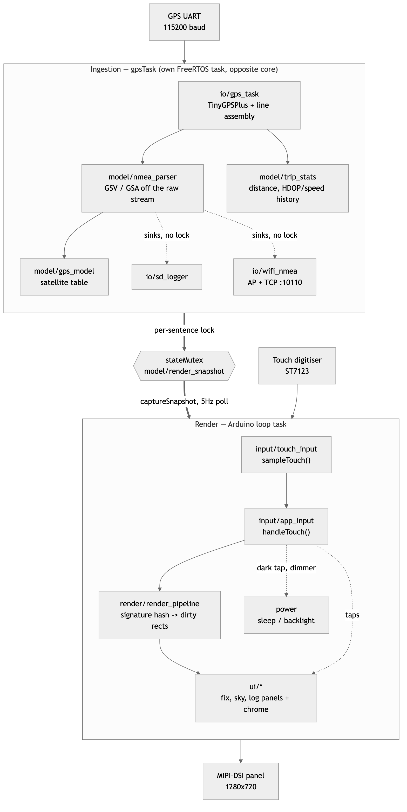
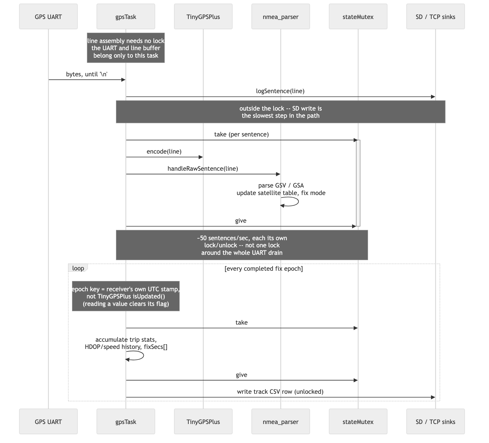
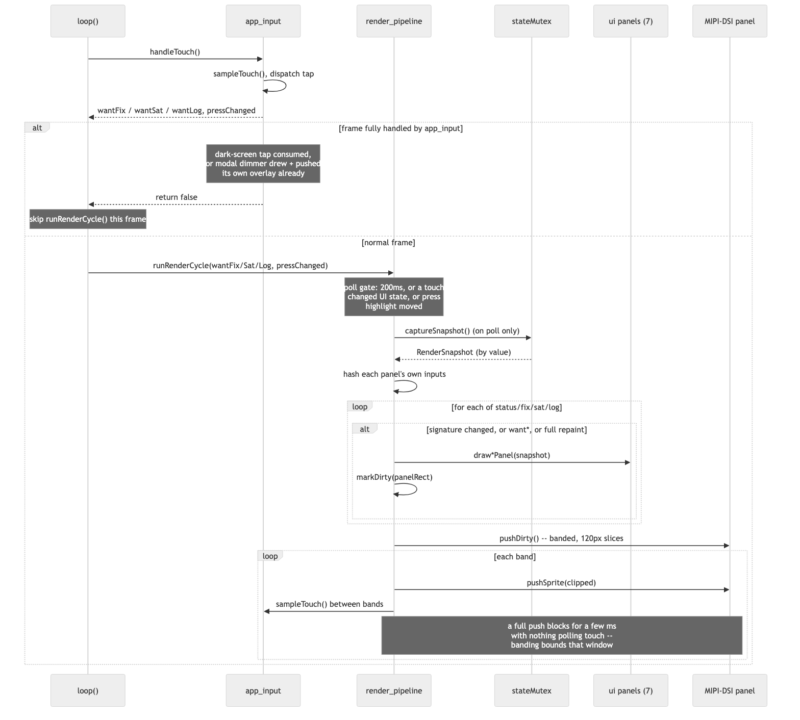
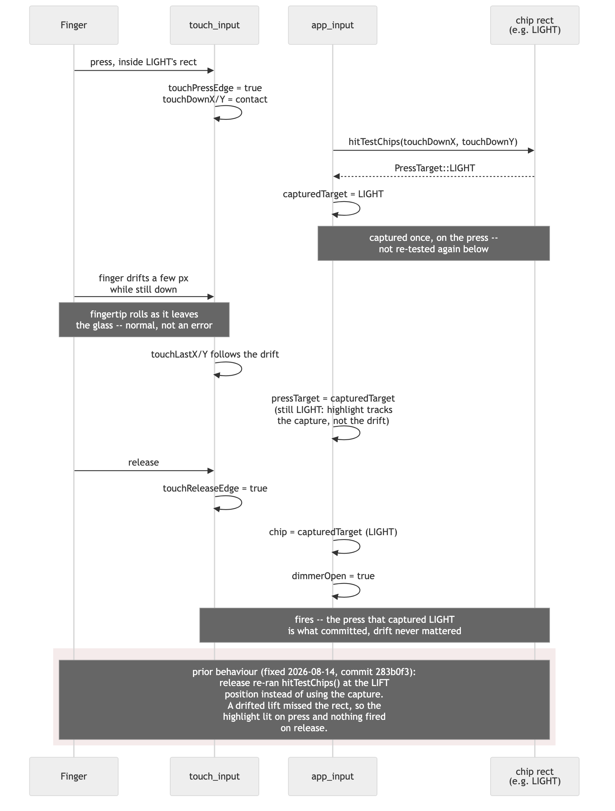

# Architecture

How the Tab5 GPS monitor firmware is put together: the module layout, the concurrency model, and the two pipelines (GPS ingestion, panel rendering) that make it up. For the history of *why* it ended up this shape — the bugs found, the performance work, the UI iterations — see [`DECISIONS.md`](DECISIONS.md).

## System overview

The firmware is two mostly-independent worlds joined at one synchronization point:

- **Ingestion** runs entirely on `gpsTask`, a FreeRTOS task pinned to the core opposite the Arduino loop task. It owns the UART, TinyGPSPlus, the satellite table, trip statistics, and the SD/Wi-Fi outputs.
- **Render** runs on the Arduino loop task: touch sampling, the dirty-rect signature system, and the seven UI panels/chrome pieces that actually draw.

The only thing that crosses between them is `stateMutex`, guarding the state `captureSnapshot()` copies into a `RenderSnapshot` — ingestion writes under the lock, render reads a snapshot and draws unlocked, so a slow SD card or a slow blit can never stall the other side.

<p align="center"></p>

## Module layout

Twenty-one module pairs under `include/<topic>/` and `src/<topic>/`, plus `src/main.cpp` as the entry point (wiring only — `setup()` brings each subsystem up in dependency order, `loop()` is four lines). PlatformIO compiles every `.cpp` under `src/` recursively and searches all of `include/` for headers, so the topic split needed no build-file changes — see [DECISIONS.md § Directory layout](DECISIONS.md#directory-layout) for how that was verified before 42 files were moved.

| Topic | Owns | Files |
|---|---|---|
| `core` | Palette, board config, the PSRAM canvas extern, card-rect layout math | `config`, `theme`, `display`, `layout` |
| `model` | Domain state: the satellite table, trip/session accumulators, NMEA parsing, the render snapshot + `stateMutex` | `gps_model`, `trip_stats`, `nmea_parser`, `render_snapshot` |
| `io` | Hardware and network boundaries: the ingestion task, SD session files, the Wi-Fi AP/TCP fan-out | `gps_task`, `sd_logger`, `wifi_nmea` |
| `ui` | The seven things that draw: shared primitives, static chrome, the top-bar/dimmer/three content panels | `ui_widgets`, `ui_chrome`, `ui_status_bar`, `ui_dimmer`, `ui_fix_panel`, `ui_sky_panel`, `ui_log_panel` |
| `input` | Touch sampling and the tap-dispatch state machine | `touch_input`, `app_input` |
| `render` | Signature hashing, dirty-rect tracking, the banded panel push | `render_pipeline` |
| `power` | Sleep/backlight state, the DCS brightness write | `power` |

`core` is used throughout and is the one topic every other topic is allowed to depend on without comment. Beyond that the real dependency graph isn't a clean top-down stack — `model` calls into `io` (NMEA parsing hands lines to the SD/TCP sinks), and `io`'s `gps_task` calls back into `model` (it needs the satellite table and parser) — that's a real two-way relationship between ingestion's data and its outputs, not an accident. `ui_dimmer` depends on `power` for the brightness write, and `power` depends on `io`'s `wifi_nmea` to gate the radio during sleep. None of this is enforced by a build-system boundary (it's all one binary); it's evidence of what actually needed to talk to what once the split was done, not a plan drawn first.

## GPS ingestion

One epoch is one receiver fix, not one drain burst — `gpsTask` wakes every 2 ms, and a second's worth of sentences arriving over ~50 ms produces on the order of 25 bursts. Per-fix work (trip accumulation, HDOP/speed history, the track CSV row) is gated on the receiver's own UTC stamp so it runs once per *fix*, not 25 times.

The lock is held per sentence, not around the whole UART drain: reading the port and assembling a line need no lock at all (the port and the line buffer belong only to this task), and the two slow sinks — the SD append and the TCP queue push — run *outside* the lock entirely, before it's even taken.

<p align="center"></p>

## Render cycle

`loop()` is two calls: `app_input::handleTouch()` samples touch and dispatches any tap, then (unless the frame was already fully handled — a dark-screen wake or the modal dimmer drawing its own overlay) `render_pipeline::runRenderCycle()` runs the poll/signature/draw/push sequence.

Each of the four regions (status bar, fix panel, sky panel, log panel) carries a signature — a hash of exactly the values it draws — sampled at most every 200 ms. A region only redraws when its signature changed, a touch explicitly asked for it, or a full repaint is pending, so panels update at whatever rate their own data actually changes rather than on a shared timer.

The final push is banded into 120-row slices with a touch sample between each. A full-canvas push moves 1280×720×2 bytes out of PSRAM with no DMA and takes long enough that a tap landing entirely inside one would otherwise never be seen at all — the driver only reads the hardware when polled.

<p align="center"></p>

## Touch input: press-capture

Every tappable target (the LIGHT/SLEEP chips, the NMEA filter chip, the dimmer's OFF/DONE, satellite dots, the three cards) commits on the press that captured it, not on a fresh hit-test of wherever the finger happened to lift. The highlight shown while a finger is down reflects the capture, not the live contact position, so what's lit is always exactly what will fire.

<p align="center"></p>

This diagram documents the current, correct behaviour; the highlighted note describes the bug it replaced. The bug itself, its symptom, and the fix are covered in [DECISIONS.md § Buttons committed on the wrong position](DECISIONS.md#buttons-committed-on-the-wrong-position).

## Concurrency summary

| | Owns | Runs on | Touches `stateMutex` |
|---|---|---|---|
| `gpsTask` | UART, TinyGPSPlus, satellite table, trip stats | Own FreeRTOS task, core opposite `loop()` | Per sentence, and per fix epoch |
| `wifiTask` | The AP, the TCP client pool, the fan-out queue | Own FreeRTOS task (`tskNO_AFFINITY`) | Never — reached only through `enqueueNmea()`, itself lock-free (a FreeRTOS queue) |
| `loop()` (render + input) | Touch state, UI state (view toggles, dimmer, filter), the canvas | Arduino's default loop task | `captureSnapshot()`, once per poll (~5 Hz); the NMEA-filter cycle's ring clear |

Touch state, view toggles, and everything else `app_input`/`render_pipeline` own are read and written only from `loop()`, so none of it needs locking against `gpsTask` — the two sides only ever meet at the snapshot.

## Regenerating the diagrams

The four diagrams are Mermaid sources rendered to PNG:

```sh
cd docs/diagrams
npx -y @mermaid-js/mermaid-cli -i 01-system-architecture.mmd -o 01-system-architecture.png -c mmdc.config.json -b white -s 2
```

(repeat per `.mmd` file). `-s 2` renders at 2x for crisp text at the embedded display width; `-b white` avoids a transparent background that would show through on a light theme. The system architecture diagram is intentionally top-down rather than left-right — a left-right layout of two subsystems this size runs wide enough to need horizontal scrolling in a rendered markdown page, which defeats the point of a diagram meant to be read in one glance.
